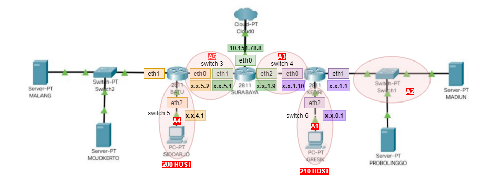
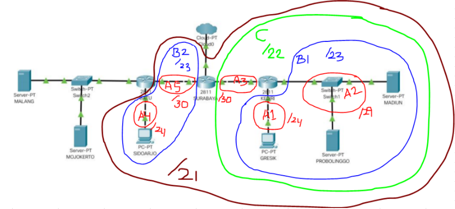
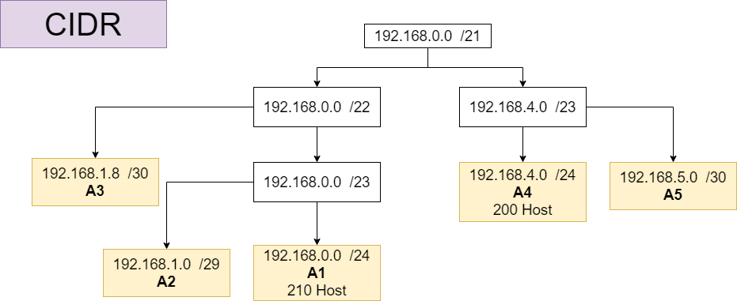
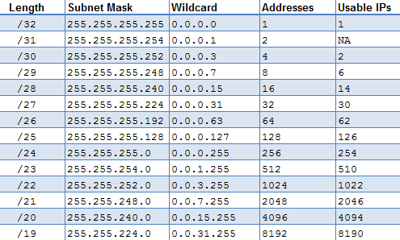
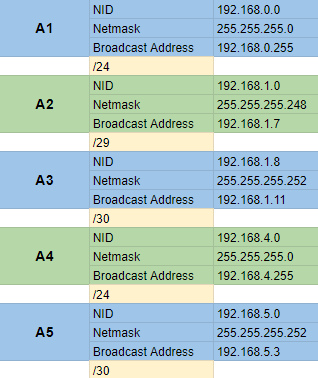

# Modul 5 : Firewall

Nama Anggota :

- 05111840000093 Muhammad Afif Fadhlurrahman
- 05111740000091 Affan Ahsanul Habib

### A 
Tugas pertama kalian yaitu membuat topologi jaringan sesuai dengan rancangan yang diberikan Bibah seperti dibawah ini :

Jawab :


```
Keterangan : 
  - SURABAYA diberikan IP TUNTAP
  - MALANG merupakan DNS Server diberikan IP DMZ
  - MOJOKERTO merupakan DHCP Server diberikan IP DMZ
  - MADIUN dan PROBOLINGGO merupakan WEB Server
  - Setiap Server diberikan memory sebesar 128M
  - Client dan Router diberikan memori sebesar 96M
  - Jumlah host pada subnet SIDOARJO 200 Host
  - Jumlah host pada subnet GRESIK 210 Host
 ``` 
### B
Karena kalian telah mempelajari Subnetting dan Routing, Bibah meminta kalian untuk membuat topologi tersebut menggunakan teknik CIDR atau VLSM. Setelah melakukan subnetting.

Jawab :

**Pada praktikum kali ini, kami menggunakan perhitungan CIDR.**

1. Pembagian Subnet 



2. Perhitungan tree CIDR





3. Hasil subnet setelah dihitung 



4. UML

- Topo

```
# Switch
uml_switch -unix switch1 > /dev/null < /dev/null &
uml_switch -unix switch2 > /dev/null < /dev/null &
uml_switch -unix switch3 > /dev/null < /dev/null &
uml_switch -unix switch4 > /dev/null < /dev/null &
uml_switch -unix switch5 > /dev/null < /dev/null &
uml_switch -unix switch6 > /dev/null < /dev/null &

# Router
xterm -T SURABAYA -e linux ubd0=SURABAYA,jarkom umid=SURABAYA eth0=tuntap,,,10.151.78.9 eth1=daemon,,,switch3 eth2=daemon,,,switch4 mem=96M &
xterm -T BATU -e linux ubd0=BATU,jarkom umid=BATU eth0=daemon,,,switch3 eth1=daemon,,,switch2 eth2=daemon,,,switch5 mem=96M &
xterm -T KEDIRI -e linux ubd0=KEDIRI,jarkom umid=KEDIRI eth0=daemon,,,switch4 eth1=daemon,,,switch1 eth2=daemon,,,switch6 mem=96M &

# Server
xterm -T MALANG -e linux ubd0=MALANG,jarkom umid=MALANG eth0=daemon,,,switch2 mem=128M &
xterm -T MOJOKERTO -e linux ubd0=MOJOKERTO,jarkom umid=MOJOKERTO eth0=daemon,,,switch2 mem=128M &
xterm -T PROBOLINGGO -e linux ubd0=PROBOLINGGO,jarkom umid=PROBOLINGGO eth0=daemon,,,switch1 mem=128M &
xterm -T MADIUN -e linux ubd0=MADIUN,jarkom umid=MADIUN eth0=daemon,,,switch1 mem=128M &

# Klien
xterm -T SIDOARJO -e linux ubd0=SIDOARJO,jarkom umid=SIDOARJO eth0=daemon,,,switch5 mem=96M &
xterm -T GRESIK -e linux ubd0=GRESIK,jarkom umid=GRESIK eth0=daemon,,,switch6 mem=96M &

```

- Interface

```
# SURABAYA
auto eth0
iface eth0 inet static
address 10.151.78.10
netmask 255.255.255.252
gateway 10.151.78.9

auto eth1
iface eth1 inet static
address 192.168.5.1
netmask 255.255.255.252

auto eth2
iface eth2 inet static
address 192.168.1.9
netmask 255.255.255.252
________________________
# BATU
auto eth0
iface eth0 inet static
address 192.168.5.2
netmask 255.255.255.252
gateway 192.168.5.1

auto eth1
iface eth1 inet static
address 10.151.79.17
netmask 255.255.255.248

auto eth2
iface eth2 inet static
address 192.168.4.1
netmask 255.255.255.0
_________________________
# KEDIRI
auto eth0
iface eth0 inet static
address 192.168.1.10
netmask 255.255.255.252
gateway 192.168.1.9

auto eth1
iface eth1 inet static
address 192.168.1.1
netmask 255.255.255.248

auto eth2
iface eth2 inet static
address 192.168.0.1
netmask 255.255.255.0
_________________________
# MALANG
auto eth0
iface eth0 inet static
address 10.151.79.18
netmask 255.255.255.248
gateway 10.151.79.17
_________________________
# MOJOKERTO
auto eth0
iface eth0 inet static
address 10.151.79.19
netmask 255.255.255.248
gateway 10.151.79.17
_________________________
# PROBOLINGGO
auto eth0
iface eth0 inet static
address 192.168.1.2
netmask 255.255.255.248
gateway 192.168.1.1
_________________________
# MADIUN
auto eth0
iface eth0 inet static
address 192.168.1.3
netmask 255.255.255.248
gateway 192.168.1.1
_________________________
# SIDOARJO
auto eth0
iface eth0 inet static
address 192.168.4.2
netmask 255.255.255.0
gateway 192.168.4.1
_________________________
# GRESIK
auto eth0
iface eth0 inet static
address 192.168.0.2
netmask 255.255.255.0
gateway 192.168.0.1

```

### C
Kalian juga diharuskan melakukan routing agar setiap perangkat pada jaringan tersebut dapat terhubung.

Jawab :

```
# SURABAYA
route add -net 192.168.4.0 netmask 255.255.254.0 gw 192.168.5.2
route add -net 192.168.0.0 netmask 255.255.252.0 gw 192.168.1.10
route add -net 10.151.79.16 netmask 255.255.255.248 gw 192.168.5.2

# BATU
route add -net 0.0.0.0 netmask 0.0.0.0 gw 192.168.5.1


# KEDIRI
route add -net 0.0.0.0 netmask 0.0.0.0 gw 192.168.1.9
```
### D 
Tugas berikutnya adalah memberikan ip pada subnet SIDOARJO dan GRESIK secara dinamis
menggunakan bantuan DHCP SERVER (Selain subnet tersebut menggunakan ip static). Kemudian
kalian mengingat bahwa kalian harus setting DHCP RELAY pada router yang menghubungkannya,
seperti yang kalian telah pelajari di masa lalu.

Jawab :
